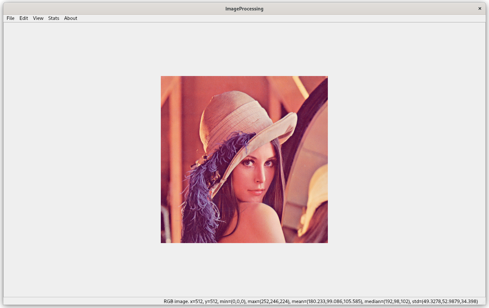
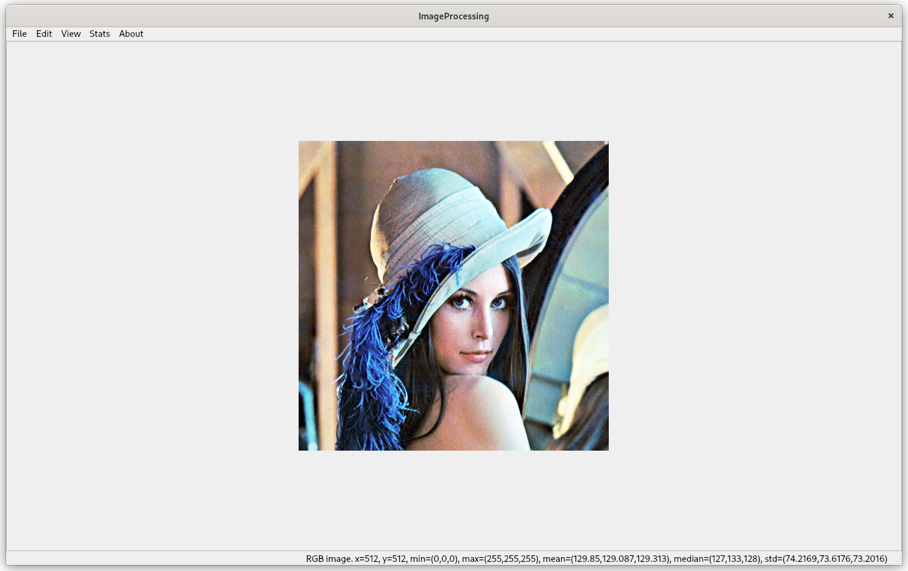
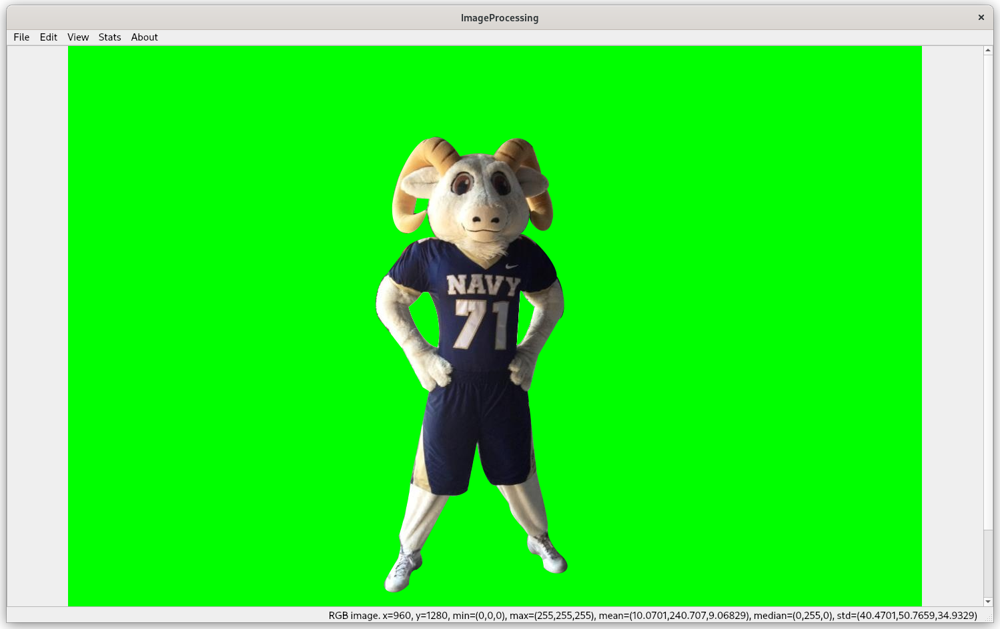
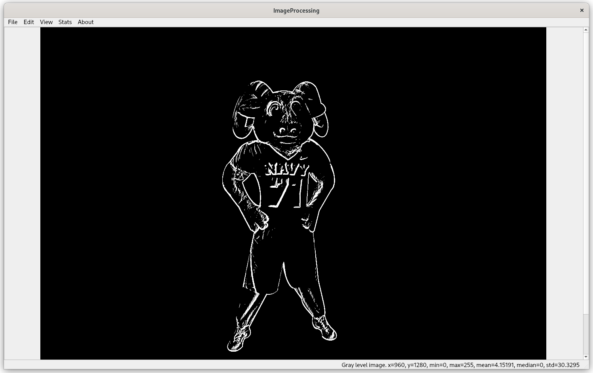
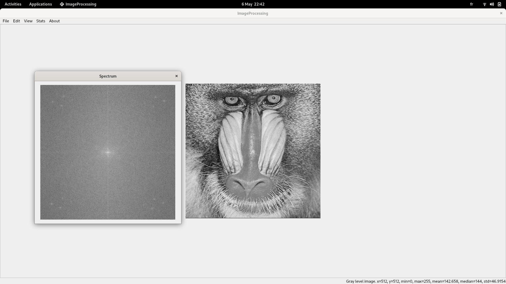
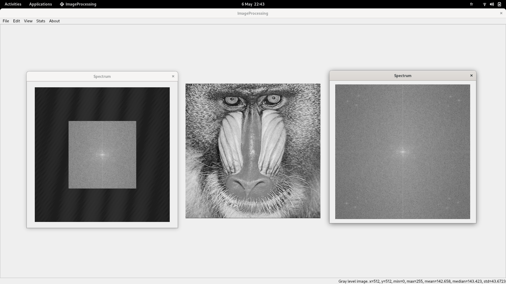
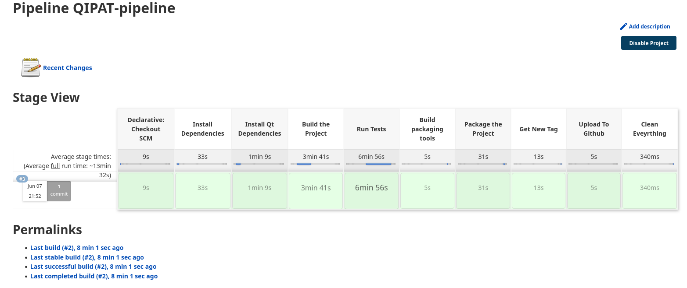

# Qt Image Processing and Analysis Toolkit : QIPAT

This is an image processing application & library built using **C++** and **Qt**. 
It contains  set of the most common image processing algorithms and techniques, which are written with an emphasis on speed. 
It uses internally the [CPLibrary](https://www.github.com/ramizouari/CPLibrary) library, that contains many optimized algorithms, data structures and mathematical functions, and [Qt](http://qt.io/) for the GUI. 
All the algorithms are implemented manually in the C++ language, and the GUI is implemented in the Qt framework. 

## 1. Features

- Supports loading, saving and processing binary, grey scale and color images.
- Showing image statistics (min, max, mean, standard deviation, histogram, etc.)
- Image processing algorithms (thresholding, filtering, edge detection, etc.)
    - **Filters**: 
      - *Linear*: Spectral, Convolution, Gaussian, Laplacian, Sobel, Prewitt, Kirsch, Scharr, LoG, etc. It supports also custom filters, such user-defined Convolution operators and Spectral filters.
      - *Non-linear*: Non-linear filters (Bilateral, Median, etc.)
    - **Thresholding**: Binary, Otsu, Sauvola, etc.
    - **Edge detection**: Canny, Laplacian, Sobel, Prewitt, Scharr, LoG, etc.
    - **Morphological**: Erosion, Dilation, Opening, Closing, etc.
    - **Color**: Color conversion, Color balance, etc.
    - **Noise**: Gaussian, Pickle & Salt, Speckle, etc.
    - **Histogram**: Histogram equalization, Histogram matching, etc.
    - **Thresholding**: Adaptive, Otsu, Sauvola, etc.
    - **Padding**: Padding, Cropping, etc.

<!---    - **Blending**: Alpha blending, Multiply, Add, Subtract, etc.
    - **Geometric**: Affine, Perspective, Rotation, etc. -->
- Supports mixing different algorithms and techniques, and applying them to the same image.
- Optimizing resource-heavy algorithms with smart data structures and algorithms, and using heuristics.
- Multi threading support for time-consuming algorithms, without sacrificing consistency.
- Easy to use, easy to understand, easy to modify, easy to extend.

## 2. Formats

It supports the following image formats:
1. PBM: Portable Bitmap
2. PGM: Portable Graymap
3. PPM: Portable Pixmap

## 3. Usage

- To use the application, you need to install the Qt6 libraries. Note that it should be also compatible with Qt5, but that was not tested.
- To compile the application, you will need also to fork this repository, and compile it with the C++20 standard.

Here is a little demo of some results of the application:

### a. Histogram equalization

Original Luna Image

Histogram equalization

### b. Edge Detection

In this example we will use the Sobel operator to detect the edges of the image.

Original Bill Image

Edge Detection

### c. Spectral filtering

In this example we will view the spectrum of our image, and will apply a spectral filter to it that will remove unwanted high frequencies.

Original Baboon Image

Baboon Image after filtering. The old spectrum is the one at right

## CICD Pipeline

### Overview

This pipeline uses **Jenkins** hosted on an an `EC2 instance` ( with an `Elastic IP` ) . The main purpose is to **package** the application and create an **AppImage** that can run from **any linux machine** ( independant from the underlying distribution ). More information about the AppImage format [here](https://appimage.org/) .

### General Pipeline

### Detailed Description

#### Checkout

This stage is managed by **jenkins**. A **webhook** has been created so each push to the **main** branch will launch our pipeline. The repository will be cloned to a **jenkins agent** running a **ubuntu 22.04** Docker image ( We use `Qt 6` and `GCC 20`, to obtain the necessary dependencies easier we're using this version of ubuntu ).

#### Install Dependencies 

In this stage we update the system and install the necessary dependencies to build the software.

#### Build

In this stage we Build our software from source ( By running `cmake` to get the build files , and then `make` to create the executables ) . The result is an **executable** representing the entry point of our application, in addition to a few **Test executables**

#### Test

In this stage we run the different tests. For simplicity we will save the results as part of the release notes ( which are going to be part of the release later on )

#### Package 

We start by getting the necessary packaging tools. We then package our main application. We add the necessary libraries and Qt plugins and then bundle them into one **AppImage**.

#### Tag

We use `git-changelog-command-line` to get the newest tag. This tool uses `Conventional Commits` to determine the new tag value. More information on `conventional commits` [here](https://www.conventionalcommits.org/)

#### Release 

Finally, We create our `Github Release`, Tag the  release and upload the binary.

### Pipeline Results

